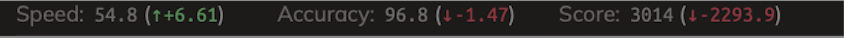
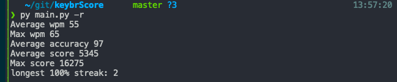
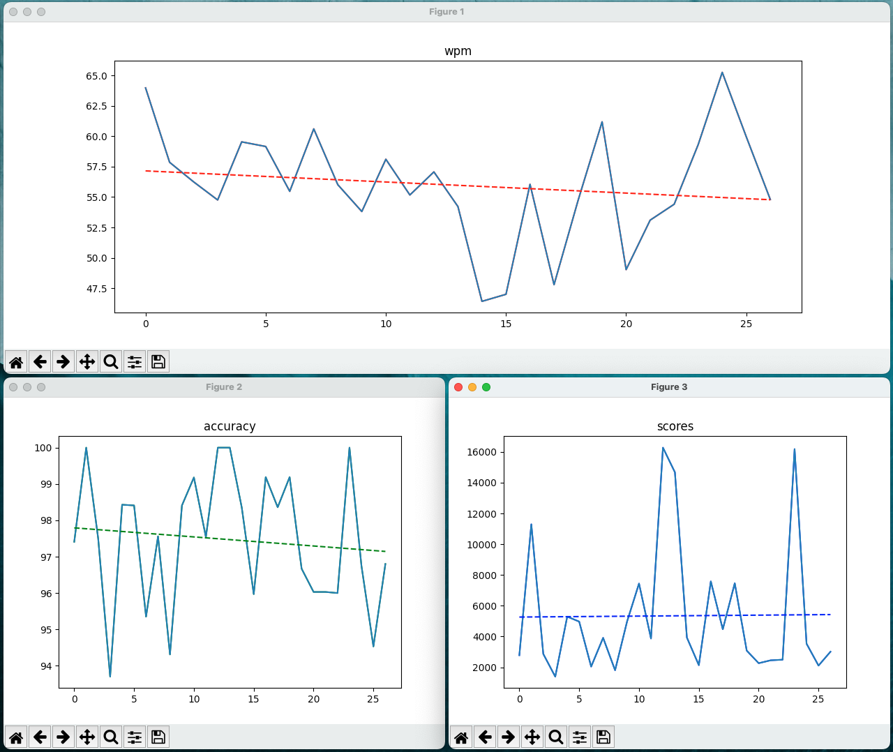

# keybr.com data reader and analyzer using OCR

Why? I want more analytics than they offer on their page.

What does it do? Read data after every type round and save it. Create analytics and stats. Give feedback.

How do I run it? Install all libraries and link your tesseract installation. Find out the pixel location of the following image and put it      
in the monitor settings in main.py. Then `touch scores.txt`. Then run `python3.10 main.py -l`. Then start typing.



Flags:
```
        case '-g':
            Analytics().graph()
        case '-l':
            runListener()
        case '-r':
            Analytics().report()
```

## Screenshots




